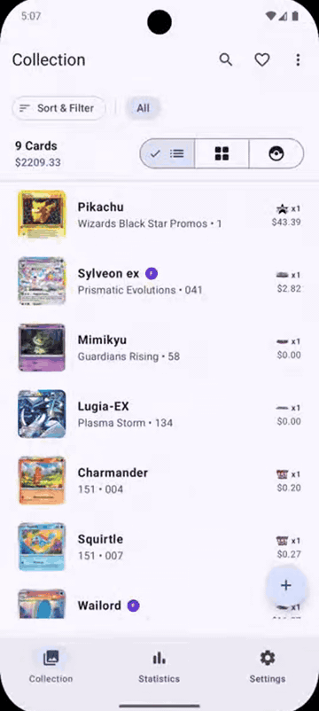
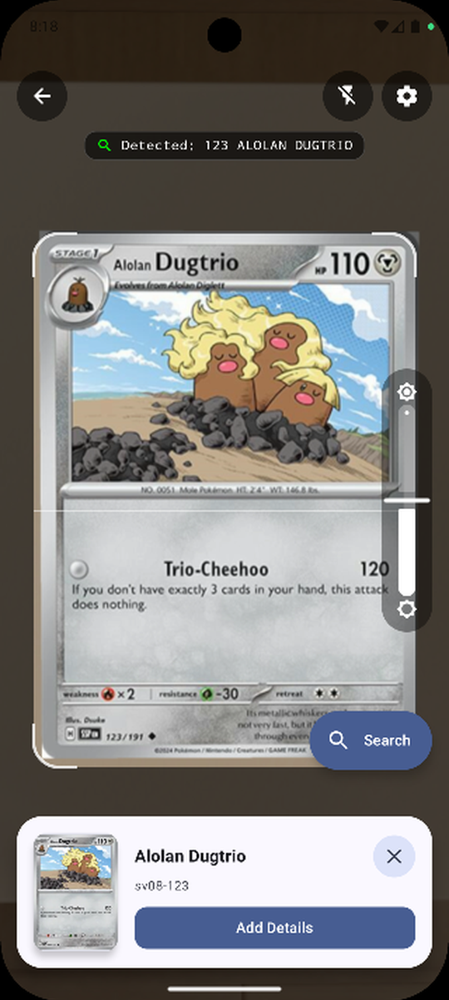
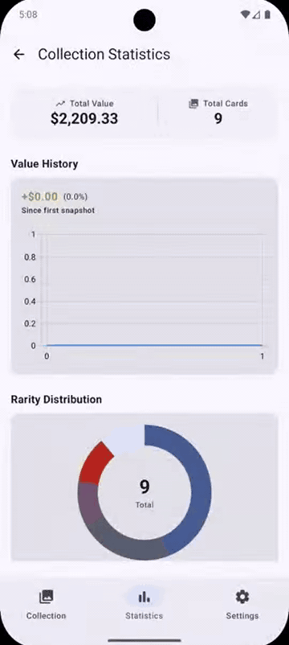
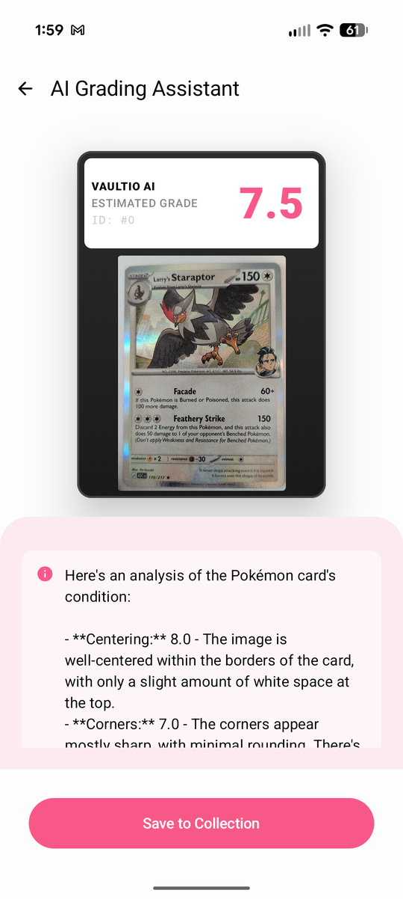

<p align="center">
  
</p>

<h1 align="center">Vaultio</h1>

<p align="center">
  <strong>Offline-first Pokémon TCG collection manager for Android</strong><br />
  Live camera scanning · local catalogs · market pricing · wishlist · stats · on-device AI grading
</p>

<p align="center">
  <a href="https://github.com/mFontecchio/vaultio/actions/workflows/ci.yml"></a>
  <a href="LICENSE"></a>
  
  
</p>

<p align="center">
  <a href="https://github.com/mFontecchio/vaultio/releases">Releases</a> ·
  <a href="https://github.com/mFontecchio/vaultio/releases/tag/nightly">Nightly</a> ·
  <a href="https://github.com/mFontecchio/vaultio/issues">Issues</a> ·
  <a href="CONTRIBUTING.md">Contributing</a>
</p>

---

## Why Vaultio

Vaultio keeps your Pokémon TCG collection on your device. Download set catalogs once, scan cards
with the camera, track prices and value over time, and get privacy-first grading estimates — without
shipping your collection to the cloud.

**Version:** 1.2.7 · **Min SDK:** 26 · **Target / compile SDK:** 36

## Features

- **Collection** — folders, list / grid / Pokédex views, search, filters, and multi-select
- **Wishlist** — track cards you want separately from what you own
- **Live scanner** — mode-first CameraX + ML Kit OCR:
  - Search, Price Check, Bulk auto-save, Page (3×3 binder), AI Grading
  - ROI crop, glare detection, multi-frame consensus, perceptual-hash disambiguation
- **Offline catalogs** — download sets from [TCGDex](https://tcgdex.dev/) for fast local matching
- **Pricing** — TCGDex primary; [JustTCG](https://justtcg.com/) fallback and vintage printings
- **Stats** — collection value history and distribution charts
- **AI grading** — on-device estimates via Gemini Nano / ML Kit GenAI (not a PSA/BGS substitute)
- **Theming** — Material 3, dynamic color, Pokémon energy-type brands

## Screenshots

Phone-aspect captures under `docs/images/` (shared **~9:20** ratio, displayed at the same width).
Collection and Stats are short GIFs so the README can show view switching and the full stats
flow; Scanner and Grading are stills. Source `.webm` clips are also resized to **540×1202**.

| Collection | Scanner |
|:---:|:---:|
|  |  |
| *List / grid / Pokédex* | *Mode-first live scan* |

| Stats | Grading |
|:---:|:---:|
|  |  |
| *Value history & charts* | *On-device AI estimates* |

## Get the app

| Build | Where |
|---|---|
| **Release** | [GitHub Releases](https://github.com/mFontecchio/vaultio/releases) for tags `v*` (e.g. `v1.2.7`) |
| **Nightly** | Rolling [Nightly](https://github.com/mFontecchio/vaultio/releases/tag/nightly) prerelease |
| **Debug** | [Actions → CI](https://github.com/mFontecchio/vaultio/actions/workflows/ci.yml) artifacts (`app-debug`) |

CI runs unit tests and `assembleDebug` on pulls and pushes to the default branch. Pushing a `v*` tag
builds a signed release APK. The Nightly workflow (schedule + manual) publishes a signed nightly APK.

---

## For developers

### Requirements

- Android Studio (recent stable) with JDK 11+ (CI uses JDK 17)
- Android device or emulator (API 26+); **camera features need a physical device**
- Optional: JustTCG API key (entered in **Settings** at runtime) for fallback / vintage pricing

### Setup

1. Clone the repo and open it in Android Studio (or sync with Gradle from the CLI).
2. Ensure `local.properties` exists (Android Studio creates it with `sdk.dir`).
3. Optionally paste a JustTCG API key in **Settings** (stored in DataStore on-device). Do **not** put
   API keys in the repo, `local.properties`, or BuildConfig.
4. Sync Gradle, then run a **debug** build.

> Schema changes bump Room and use `fallbackToDestructiveMigration()` — local DB data is wiped on
> version bumps. Back up anything you care about before upgrading schema-changing builds.

### Tech stack

| Area | Choice |
|---|---|
| Language / UI | Kotlin, Jetpack Compose, Material 3 |
| Architecture | MVI (`UiState` / `Event` / `Effect`), manual DI |
| Persistence | Room, DataStore Preferences |
| Networking | Retrofit, Moshi, OkHttp |
| Camera / OCR | CameraX, ML Kit Text Recognition |
| Charts | Vico |
| Background | WorkManager |
| Images | Coil |

Single Gradle module: `:app`.

### Build types

| Type | Application ID | Notes |
|---|---|---|
| `debug` | `com.mrhayami.vaultio.debug` | Debuggable; verbose HTTP logging; debug keystore |
| `nightly` | `com.mrhayami.vaultio.nightly` | Release-like minify/shrink; separate icon / name |
| `release` | `com.mrhayami.vaultio` | Minify/shrink; Play identity |

Each type can override `vaultio_icon.webp` under the matching source set. Locally, release/nightly fall
back to the debug keystore when no upload keystore is configured. CI signs release and nightly with
the upload keystore from GitHub Secrets.

Maintainer signing: copy [`keystore.properties.example`](keystore.properties.example) to
`keystore.properties` (gitignored), or set `VAULTIO_KEYSTORE_*` secrets for Actions. Never commit
keystores or passwords.

### CLI

```bat
gradlew.bat assembleDebug --console=plain
gradlew.bat assembleNightly --console=plain
gradlew.bat assembleRelease --console=plain
gradlew.bat testDebugUnitTest --console=plain
```

On macOS / Linux, use `./gradlew` instead of `gradlew.bat`.

### Project layout

```
app/src/main/java/com/mrhayami/vaultio/
├── MainActivity.kt              # Navigation host
├── VaultioApplication.kt        # Manual dependency wiring
├── data/                        # Room, APIs, repository, workers, utils
└── ui/                          # Feature packages (collection, scanner, wishlist, …)
```

Notable packages:

- `data/repository/VaultioRepository.kt` — catalog, collection, wishlist, pricing hub
- `ui/scanner/` — camera analyzer, geometry, modes, bulk / page flows
- `ui/collection/`, `ui/wishlist/`, `ui/stats/`, `ui/grading/`, `ui/settings/`

### Architecture notes

- **MVI** ViewModels with unidirectional state; shared base in `ui/common/MviViewModel.kt`
- **No DI framework** — constructors + `ViewModelProvider.Factory` from `VaultioApplication`
- **Navigation** — sealed `Screen` routes in `ui/navigation/Screen.kt`, hosted in `MainActivity`
- **Scanner matching priority** — `number/total` → `prefix+number` → standalone number, then pHash

## Privacy & data sources

- Collection and grading images stay on-device; grading uses on-device models where available
- Catalog / pricing traffic goes to TCGDex and (optionally) JustTCG
- JustTCG keys are Settings-only (DataStore); never commit keys or keystores
- Camera and Internet permissions are required for scanning and online enrichment

See [SECURITY.md](SECURITY.md) for vulnerability reporting.

## Contributing

See [CONTRIBUTING.md](CONTRIBUTING.md) for setup, conventions, and PR expectations.

- Bug reports and feature requests use GitHub issue forms under **New issue**
- Pull requests use the template in `.github/PULL_REQUEST_TEMPLATE.md`

## License

Licensed under the [Apache License 2.0](LICENSE).

```
Copyright 2026 Michael Fontecchio
```

See [NOTICE](NOTICE) for attribution and trademark notes. Pokémon and related marks belong to
their respective owners; Vaultio is an unofficial fan project.
