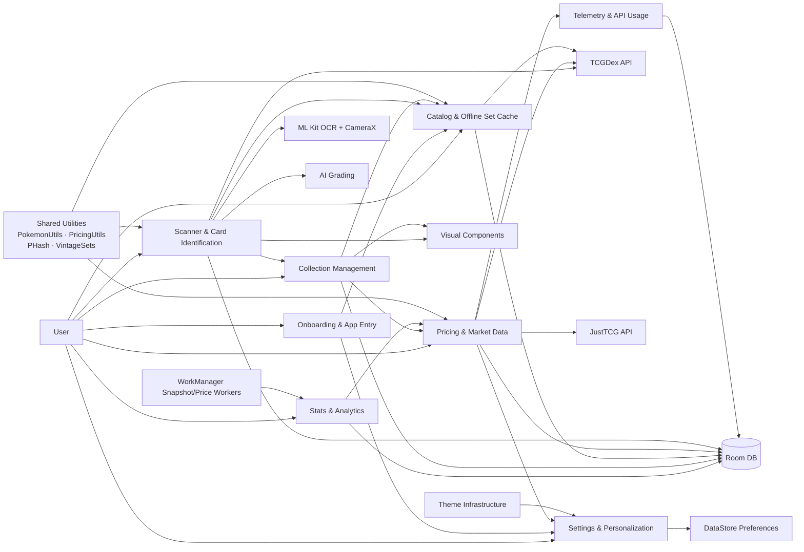

# Vaultio Context Map

## Purpose
Single-source-of-truth reference for AI agents working on `Vaultio`. Describes every bounded context, file, entity, relationship, and in-progress plan so agents can orient quickly without reading every source file.

> **Last updated:** 2026-05-19 (rev 4)
> **Changes in this revision:** Improved scanner accuracy and versatility (prioritized OCR regex,
> tightened ROI, 3-frame consensus stability); implemented on-the-fly image-based disambiguation using
> perceptual hashing (pHash) and remote image fetching; added `updateCardPHash` and
`fetchBitmapFromUrl` to repository; updated app version to `1.1.1` (versionCode 3); DB at version
14.

---

## Quick Reference — File Inventory

```
app/src/main/java/com/mrhayami/vaultio/
├── MainActivity.kt                         # Navigation host, theme wiring, walkthrough gating
├── VaultioApplication.kt                   # DI root: creates DB, Retrofit clients, Repository
├── data/
│   ├── local/
│   │   ├── Entities.kt                     # Room entities: Set, Card, UserCard, Folder, FolderCardCrossRef, Price, VintagePrice, PriceMeta, ApiUsage, TelemetryLog, CollectionSnapshot, CardGrade
│   │   ├── Daos.kt                         # Room DAOs: SetDao, CardDao, UserCardDao, FolderDao, PriceDao, ApiUsageDao, TelemetryDao, CollectionSnapshotDao, CardGradeDao
│   │   └── VaultioDatabase.kt              # Room DB singleton (version 14, destructive migration)
│   ├── remote/
│   │   ├── TcgDexApi.kt                    # Retrofit interface + response models for TCGDex
│   │   └── JustTcgApi.kt                   # Retrofit interface + response models for JustTCG
│   ├── repository/
│   │   ├── VaultioRepository.kt            # Central integration hub (catalog, collection, pricing, telemetry, image fetch)
│   │   ├── GradingRepository.kt            # Grading logic using Gemini Nano
│   │   └── GeminiNanoClient.kt             # Interface for on-device AI operations
│   ├── workers/
│   │   └── CollectionSnapshotWorker.kt     # WorkManager worker for daily snapshots
│   ├── UserPreferencesRepository.kt        # DataStore preferences (theme, sort, view, animations, API key, walkthrough, bulk-scan defaults)
│   ├── PHash.kt                            # dHash perceptual hashing (64-bit, Hamming distance)
│   ├── PokemonUtils.kt                     # Static Gen 1–9 dex map (1025 species) + name extraction/normalization
│   ├── PricingUtils.kt                     # Finish/printing/condition constants + TCGDex/JustTCG mapping helpers
│   └── VintageSets.kt                      # Vintage set config registry (base1–neo4, JustTCG slug routing)
└── ui/
    ├── card_detail/
    │   ├── CardDetailContract.kt           # MVI contract: CardDetailUiState / CardDetailEvent / CardDetailEffect
    │   ├── CardDetailScreen.kt             # Compose screen for single-card detail (3D tilt, holofoil, price, folder, edit)
    │   └── CardDetailViewModel.kt          # ViewModel with SavedStateHandle; observes card+folders+prices+prefs
    ├── collection/
    │   ├── CollectionScreen.kt             # Compose screen: list/grid/pokédex views, search, filter, multi-select, add card
    │   └── CollectionViewModel.kt          # ViewModel: combines 19 flows into CollectionUiState; defines ViewMode, SortMode, SortDirection, ListSettings, GridSettings, PokedexSettings, FilterSettings, PokedexEntry
    ├── grading/
    │   └── GradingViewModel.kt             # ViewModel for card grading flow
    ├── components/
    │   ├── ThreeDCard.kt                   # ThreeDCardContainer: gyro-driven 3D tilt + touch pan/zoom
    │   ├── VisualEffects.kt                # Modifier.holoEffect and finish-specific shader extensions
    │   └── MetadataModal.kt                # Add-to-collection form (quantity/condition/printing/finish/folder chips)
    ├── navigation/
    │   └── Screen.kt                       # Sealed class: Collection, SetDownloads, Settings, Scanner, Walkthrough
    ├── scanner/
    │   ├── BulkScanModels.kt               # BulkScanDefaults, BulkScanStatus enum, BulkScanEntry data class
    │   ├── PageScanModels.kt               # Page scan (binder) modes and cell models
    │   ├── PageScanProcessor.kt            # Logic for grid detection and cell cropping
    │   ├── CameraAnalyzer.kt               # ImageAnalysis.Analyzer: ROI crop → pHash → contrast enhance → ML Kit OCR → DetectedLine list
    │   ├── ScannerScreen.kt                # Compose screen: camera preview, ROI overlay, candidate list, bulk-mode HUD
    │   └── ScannerViewModel.kt             # MVI: ScannerUiState / ScannerEvent; consensus buffer, search pipeline, prioritized regex, on-the-fly pHash
    ├── screens/
    │   ├── SetDownloadsViewModel.kt        # ViewModel for set catalog management
    │   ├── SetDownloadsContract.kt         # Contract for set download screen
    │   └── SetDownloadsScreen.kt           # Set catalog browser: download/delete sets
    ├── settings/
    │   ├── SettingsScreen.kt               # Compose screen: theme, animations, API key, quota, reset
    │   └── SettingsViewModel.kt            # ViewModel: auto-refreshes quota on open; SettingsUiState
    ├── stats/
    │   ├── StatsScreen.kt                  # Collection value history and distribution charts
    │   └── StatsViewModel.kt               # ViewModel for analytics and charts
    ├── theme/
    │   ├── Color.kt                        # Color palette: Material defaults + 10 Pokémon energy seed colors
    │   ├── Theme.kt                        # VaultioTheme composable: dynamic color, 10 energy themes, status bar sync
    │   └── Type.kt                         # Typography definitions
    └── walkthrough/
        └── WalkthroughScreen.kt            # First-run onboarding pages
```

---

## System Scope

`Vaultio` is a single-module Android app (Kotlin, Jetpack Compose, Room, Retrofit, CameraX, ML Kit,
Gemini Nano) for managing a Pokémon TCG collection. It supports:
- maintaining a personal card collection with folders, conditions, finishes, printings
- downloading and caching set/card catalog data for offline use
- scanning cards with refined prioritized OCR, 3-frame consensus, and on-the-fly pHash
  disambiguation
- **bulk scanning mode** for rapid high-confidence card capture with auto-save
- **page scanning mode** for digitizing full binder pages (3x3 grid)
- **card grading** using on-device AI (Gemini Nano) for condition assessment
- fetching market pricing from TCGDex (primary) and JustTCG (fallback + vintage)
- tracking collection value history with daily snapshots and Vico charts
- storing user preferences, onboarding state, and API credentials
- rendering advanced card visuals (3D gyro tilt, animated holofoil shaders)
- 10 Pokémon energy-type themes + dynamic color + light/dark modes

---

## High-Level Context Map



---

## Bounded Contexts

### 1. Collection Management
**Primary responsibility:** manage the user-owned collection and its organization.

**Core concepts**
- `UserCardEntity` — quantity, condition, printing, finish, manualPrice, dateAdded
- `FolderEntity` — name, icon, color
- `FolderCardCrossRef` — many-to-many join between folders and user cards
- `CardWithDetails` — joined view: UserCard + CardEntity + SetEntity
- `CollectionUiState` — full UI state: userCards, filteredUserCards, pokedexEntries, folders, selectedFolderId, searchQuery, isSelectionMode, selectedIds, totalValue, totalCount, totalQuantity, available filter options, sets map, showSaveSuccess
- `ViewMode` enum — `LIST`, `GRID`, `POKEDEX`
- `SortMode` enum — `NAME`, `SET`, `VALUE`, `DATE_ADDED`, `RARITY`, `QUANTITY`, `NUMBER`
- `SortDirection` enum — `ASCENDING`, `DESCENDING`
- `ListSettings` — showPrices, isCompact
- `GridSettings` — columns, showBadges
- `PokedexSettings` — showUncollected, useShinySprites
- `FilterSettings` — rarities, categories, types, conditions, finishes (all multi-select `Set<String>`)
- `PokedexEntry` — dexNumber, pokemonName, cardCount, totalQuantity, representativeImage, isCollected

**Files**
| File | Key exports |
|---|---|
| `ui/collection/CollectionViewModel.kt` | `CollectionViewModel`, `CollectionViewModelFactory`, all enums/settings data classes above, `CollectionUiState` |
| `ui/collection/CollectionScreen.kt` | Main collection Compose screen |
| `ui/card_detail/CardDetailContract.kt` | `CardDetailUiState` / `CardDetailEvent` / `CardDetailEffect` |
| `ui/card_detail/CardDetailViewModel.kt` | `CardDetailViewModel` (takes `SavedStateHandle`), `CardDetailViewModelFactory` |
| `ui/card_detail/CardDetailScreen.kt` | Single-card detail Compose screen |
| `data/local/Entities.kt` | `UserCardEntity`, `FolderEntity`, `FolderCardCrossRef` |
| `data/local/Daos.kt` | `UserCardDao`, `FolderDao`, `CardWithDetails` |
| `data/repository/VaultioRepository.kt` | `addUserCard`, `updateUserCard`, `deleteUserCard`, `deleteUserCards`, folder CRUD, `allUserCards`, `allFolders`, `allFolderCardCrossRefs` |

**Capabilities**
- add cards to the collection (from scanner, bulk scan, or collection search)
- update quantity / condition / printing / finish
- remove cards; bulk delete and bulk move to folder
- group cards into folders with folder filtering
- full-text search across card name, `pokemonName`, and set name
- multi-select bulk operations (toggle, select-all, clear)
- filter by rarity / category / type / condition / finish
- sort by name, set, value, date added, rarity, quantity, or number (ascending/descending)
- derive total collection value (price × quantity) and summary counts
- derive Pokédex-style view from dex IDs and extracted Pokémon names
- search TCGDex remotely for adding new cards
- remote search state exposed via `remoteSearchState` (results + loading pair)

**Depends on**
- **Catalog & Offline Set Cache** for canonical card and set identities
- **Pricing & Market Data** for computed collection value (`allPrices` + `allVintagePrices` flows)
- **Settings & Personalization** for view/sort/list/grid/pokédex preferences and `preferSetLogo`
- **Visual Components** for card rendering (3D tilt, holofoil shader)
- **PokemonUtils** for Pokédex name extraction in the Pokédex view computation

**Relationship style**
- downstream of `Catalog & Offline Set Cache`
- downstream of `Pricing & Market Data`

---

### 2. Catalog & Offline Set Cache
**Primary responsibility:** maintain the local reference catalog of sets and cards.

**Core concepts**
- `SetEntity` — id, name, series, logo, symbol, totalCards, officialCards, releaseDate, isDownloaded
- `CardEntity` — id, localId, name, image, setId, rarity, category, types, dexId, dexIds, pokemonName, tcgPlayerId, pHash, lastUpdated
- downloaded vs non-downloaded sets
- local searchable card catalog
- dex ID enrichment and fallback resolution (API → local DB → network recovery → static map)
- perceptual hash storage for scanner disambiguation

**Files**
| File | Key exports |
|---|---|
| `data/local/Entities.kt` | `SetEntity`, `CardEntity` |
| `data/local/Daos.kt` | `SetDao`, `CardDao` (incl. `getCardsByLocalIdAndSetTotal`, `getCardsByPokemonName`, `getCardCount`) |
| `data/local/VaultioDatabase.kt` | `VaultioDatabase` (version 11, 10 entities) |
| `ui/screens/SetDownloadsScreen.kt` | Set download browser screen |
| `data/repository/VaultioRepository.kt` | `refreshSets`, `downloadSet`, `deleteDownloadedSet`, `searchLocalCards`, `searchLocalCardsWithTotal`, `allSets` |
| `data/PokemonUtils.kt` | Static Pokédex map + name extraction (used during set download enrichment) |
| `data/PHash.kt` | dHash computation (column exists on CardEntity; population at download time not yet wired) |

**Capabilities**
- pull set metadata from TCGDex
- download full set details into Room
- preserve download flags across refreshes
- keep local set/card data usable for offline matching
- enrich cards with dex IDs (multi-strategy fallback) and TCGPlayer IDs at download time
- extract and store `pokemonName` at download time via `PokemonUtils.extractPokemonName`
- `CardEntity.pHash` column exists (population at download time not yet wired — hashes are computed live in scanner)

**External dependency**
- **TCGDex API** is the authoritative upstream catalog provider

**Relationship style**
- customer/supplier with `TCGDex API`
- upstream to `Collection Management`
- upstream to `Scanner & Card Identification`
- upstream to parts of `Pricing & Market Data`

---

### 3. Scanner & Card Identification
**Primary responsibility:** identify cards from camera input using OCR and local/remote lookup, with single-card and bulk-scan modes.

**Core concepts**
- ROI crop to card rectangle (~85% width, 1.397 aspect ratio) before any processing
- per-frame contrast enhancement (1.4x contrast + brightness boost)
- pHash computation from cropped frame via `PHash.computeHash()`
- ML Kit Text Recognition v2 on enhanced crop
- `DetectedLine` — text, boundingBox, imageWidth, imageHeight
- name region extraction (top ~25% of cropped card)
- collector number extraction (bottom ~25% of cropped card, `X/TOTAL` regex)
- OCR character-substitution normalization scoped to numeric tokens (`O→0`, `I→1`, `L→1`, `S→5`, `B→8`, `G→6`, `D→0`, `Z→2`, `Q→9`)
- `FrameDetection` ring buffer (5 frames, 3-of-5 consensus for number, majority vote for total/name)
- card name cleaning (noise-word removal, prefix stripping)
- 120ms scan throttle interval
- multi-step search pipeline: local number+total → local number-only → pHash disambiguation (Hamming < 12) → name similarity filter → API fallback → composite ranking
- `ScannerUiState` / `ScannerEvent` MVI pattern
- **Bulk Scan Mode**: `BulkScanDefaults` (condition/printing/finish/folderIds), `BulkScanStatus` enum (`SAVED`/`DUPLICATE_INCREMENTED`/`SKIPPED_AMBIGUOUS`), `BulkScanEntry`, auto-save on single-candidate match, skip+queue for ambiguous, duplicate increment, undo support

**Files**
| File | Key exports |
|---|---|
| `ui/scanner/CameraAnalyzer.kt` | `CameraAnalyzer` (ImageAnalysis.Analyzer), `DetectedLine` |
| `ui/scanner/ScannerViewModel.kt` | `ScannerViewModel`, `ScannerViewModelFactory`, `ScannerUiState`, `ScannerEvent` |
| `ui/scanner/ScannerScreen.kt` | Scanner Compose screen (camera preview, ROI overlay, candidates, bulk HUD) |
| `ui/scanner/BulkScanModels.kt` | `BulkScanDefaults`, `BulkScanStatus`, `BulkScanEntry` |
| `ui/components/MetadataModal.kt` | Presented in single-scan mode before saving a confirmed card |
| `data/PHash.kt` | `PHash.computeHash()`, `PHash.hammingDistance()` |
| `data/PokemonUtils.kt` | Used for name normalization |

**Capabilities**
- capture live camera frames via CameraX
- crop to card ROI before OCR (reduces noise and compute)
- compute pHash from cropped frame for disambiguation
- run enhanced single-pass OCR on the full crop, then zone-filter results by bounding box position
- extract top-of-card name and bottom collector number from positional analysis
- apply character-substitution normalization to numeric tokens only
- stabilize noisy OCR with a 5-frame ring buffer (3-of-5 consensus)
- prefer local offline matches before remote search
- compare pHash from live frame against stored card hashes (Hamming distance < 12 = strong match)
- rank candidates with name similarity (Levenshtein distance) when multiple remain
- **Single-scan mode**: present `MetadataModal` overlay for quantity/condition/printing/finish entry; pause scanning
- **Bulk-scan mode**: auto-save single-candidate matches with pre-configured defaults; increment quantity for duplicate scans; skip ambiguous matches to review queue; undo last bulk save; bulk defaults persisted in DataStore
- save matched cards into the collection via `VaultioRepository.addUserCard()`

**Depends on**
- **Catalog & Offline Set Cache** for fast local resolution and pHash lookup
- **Collection Management** to persist identified cards as owned cards
- **TCGDex API** for remote fallback search
- **ML Kit OCR + CameraX** as platform/external capabilities
- **Settings & Personalization** for persisted bulk-scan defaults

**Relationship style**
- downstream of `Catalog & Offline Set Cache`
- feeds `Collection Management`
- conformist/customer to `TCGDex API` response model

---

### 4. Pricing & Market Data
**Primary responsibility:** resolve current market prices and quota/telemetry around pricing calls.

**Core concepts**
- `PriceEntity` — cardId + finish + condition composite key; marketPrice, lowPrice, midPrice, highPrice, source, timestamp
- `VintagePriceEntity` — cardId + finish + printing + condition composite key; same price fields
- `PriceMetaEntity` — tracks last-fetch time and last error per ID (⚠ entity exists but **no dedicated DAO** — not queryable yet)
- `ApiUsageEntity` — daily + plan quota tracking, `lastSyncedAt`
- `TelemetryLogEntity` — api, endpoint, status, latency, timestamp
- modern vs vintage pricing strategy
- TCGDex primary pricing (maps normal/holofoil/reverse finish)
- JustTCG fallback (modern) and vintage specialization
- `VintageSets` registry for vintage set routing (base1–neo4)
- `PricingUtils` for standardized finish/printing/condition constants and cross-source mapping

**Files**
| File | Key exports |
|---|---|
| `data/repository/VaultioRepository.kt` | `updateCardPrice`, `updateVintageCardPrice`, `updateCardPriceFromJustTCG`, `updatePricesBatch`, `syncApiUsage`, `refreshApiUsageFromApi`, `logTelemetry`, `getApiUsageFlow`, `allPrices`, `allVintagePrices` |
| `data/workers/PriceUpdateWorker.kt` | `PriceUpdateWorker` (WorkManager CoroutineWorker) |
| `data/PricingUtils.kt` | `FINISH_*`, `PRINTING_*`, `CONDITION_*` constants; `normalizeCardNumber`; `mapTcgDexPrices`; `mapJustTcgVariantToPrice`; `mapJustTcgVariantToVintagePrice`; `mapToJustTcgPrinting`; `parseJustTcgPrinting` |
| `data/VintageSets.kt` | `VintageSetConfig`, `VintageSets.isVintageSet()`, `getVintageConfig()`, `getJustTcgSetId()` |
| `data/local/Entities.kt` | `PriceEntity`, `VintagePriceEntity`, `PriceMetaEntity`, `ApiUsageEntity`, `TelemetryLogEntity` |
| `data/local/Daos.kt` | `PriceDao`, `ApiUsageDao`, `TelemetryDao` |

**Capabilities**
- fetch standard prices from TCGDex (`normal`, `holofoil`, `reverse` finish lanes)
- fall back to JustTCG when TCGDex yields no prices
- use JustTCG as primary source for vintage set logic
- route vintage sets to the correct JustTCG set ID (including shadowless variants) via `VintageSets`
- normalize finish/printing/condition strings across sources via `PricingUtils`
- map TCGDex and JustTCG price responses to `PriceEntity` / `VintagePriceEntity`
- track per-record fetch metadata in `PriceMetaEntity` (⚠ no DAO yet)
- store per-day API usage and plan limits
- log endpoint/status/latency telemetry
- run background refreshes through WorkManager
- rate-limit JustTCG calls via `canUseJustTcg()` daily-remaining check
- vintage pricing queries multiple slugs (unlimited + shadowless) with 500ms delay between

**Depends on**
- **Catalog & Offline Set Cache** for card identity and metadata
- **Settings & Personalization** for JustTCG API key
- **TCGDex API** and **JustTCG API** for external price data

**Relationship style**
- downstream of `Catalog & Offline Set Cache`
- downstream of `Settings & Personalization`
- customer/supplier with `TCGDex API`
- customer/supplier with `JustTCG API`
- upstream to `Collection Management` for valuation

---

### 5. Settings & Personalization
**Primary responsibility:** store user preferences, feature toggles, credentials, and app-entry state.

**Core concepts**
- `ThemeBrand` enum — DEFAULT, GRASS, FIRE, WATER, ELECTRIC, PSYCHIC, FIGHTING, DARKNESS, STEEL, FAIRY, DRAGON (11 values)
- `DarkThemeConfig` enum — FOLLOW_SYSTEM, LIGHT, DARK
- animation flags (energy animations, finish animations)
- set-logo preference
- view/sort/layout settings (viewMode, sortMode, list/grid/pokédex settings)
- JustTCG API key
- walkthrough completion state
- bulk-scan default preferences (condition, printing, finish, folderIds)
- `SettingsUiState` — theme, animations, preferSetLogo, API key, quota stats, offlineSetsCount, isRefreshing

**Files**
| File | Key exports |
|---|---|
| `data/UserPreferencesRepository.kt` | `UserPreferencesRepository`, `ThemeBrand`, `DarkThemeConfig`; all DataStore preference flows and setters |
| `ui/settings/SettingsViewModel.kt` | `SettingsViewModel`, `SettingsViewModelFactory`, `SettingsUiState` |
| `ui/settings/SettingsScreen.kt` | Settings Compose screen |
| `MainActivity.kt` | Reads `themeBrand`, `darkThemeConfig`, `shouldShowWalkthrough` at startup |

**DataStore keys** (21 total)
`view_mode`, `sort_mode`, `list_show_prices`, `list_is_compact`, `grid_columns`, `grid_show_badges`, `pokedex_show_uncollected`, `pokedex_use_shiny_sprites`, `theme_brand`, `dark_theme_config`, `show_energy_animations`, `show_finish_animations`, `just_tcg_api_key`, `prefer_set_logo`, `should_show_walkthrough`, `bulk_scan_condition`, `bulk_scan_printing`, `bulk_scan_finish`, `bulk_scan_folder_ids`

**Capabilities**
- persist preferences in DataStore
- control app theming and layout defaults
- store and expose JustTCG API key
- decide whether walkthrough shows on startup
- refresh and expose JustTCG usage/quota state in settings (auto-refresh if stale > 5 min)
- expose animation feature flags consumed by `CardDetailUiState` and visual components
- persist bulk-scan default metadata across sessions
- full settings reset (theme, sort, view, animations, API key, list/grid/pokédex settings)

**Depends on**
- `DataStore Preferences`
- `Pricing & Market Data` for quota refresh/display

**Relationship style**
- upstream to `Pricing & Market Data` because API key enables JustTCG access
- upstream to `Scanner & Card Identification` for persisted bulk-scan defaults
- upstream to UI-facing contexts because it drives behavior and presentation

---

### 6. Onboarding & App Entry
**Primary responsibility:** guide first-run setup and route the user into the app.

**Core concepts**
- walkthrough pages
- first-run gating
- navigation start destination
- recommended setup guidance

**Files**
| File | Key exports |
|---|---|
| `ui/walkthrough/WalkthroughScreen.kt` | Walkthrough Compose screen |
| `ui/navigation/Screen.kt` | Sealed class defining all navigation routes |
| `MainActivity.kt` | `NavHost` setup, start destination logic, `card_detail/{userCardId}` inline route |

**Navigation routes**
| Route | Screen |
|---|---|
| `walkthrough` | `WalkthroughScreen` |
| `collection` | `CollectionScreen` (from `ui/collection/`) |
| `set_downloads` | `SetDownloadsScreen` |
| `settings` | `SettingsScreen` (from `ui/settings/`) |
| `scanner` | `ScannerScreen` |
| `card_detail/{userCardId}` | `CardDetailScreen` (inline route, not in `Screen.kt`) |

**Capabilities**
- decide first screen based on `shouldShowWalkthrough`
- instruct the user to: add a JustTCG API key, download sets for better scanning, understand feature tradeoffs

**Depends on**
- **Settings & Personalization** for walkthrough completion state

**Relationship style**
- downstream of `Settings & Personalization`
- advisory upstream influence on `Catalog & Offline Set Cache` and `Pricing & Market Data`

---

### 7. Visual Components
**Primary responsibility:** provide reusable, presentation-only Compose components for card rendering and data-entry overlays.

**Core concepts**
- 3D gyroscope-driven card tilt (rotation-vector sensor)
- touch gesture pan/zoom (`pointerInput`)
- holofoil shader (spectral gradient, specular flare, galaxy grain)
- finish-specific overlay selection (normal, holofoil, reverse, textured, gold)
- card metadata entry modal (quantity, condition, printing, finish, folder assignment)

**Files**
| File | Key exports |
|---|---|
| `ui/components/ThreeDCard.kt` | `ThreeDCardContainer` composable |
| `ui/components/VisualEffects.kt` | `Modifier.holoEffect(...)` and finish-specific `Modifier` extensions |
| `ui/components/MetadataModal.kt` | `MetadataModal` composable; `DropdownSelector` |

**Capabilities**
- render a card image with real-time 3D perspective rotation
- apply per-finish animated holofoil overlays
- present an add-to-collection form (quantity/condition/printing/finish/folder chips)
- expose a reusable `DropdownSelector` for picker fields
- remain stateless with respect to business logic (pure presentation)

**Depends on**
- `PricingUtils` for finish/printing/condition constants (display only)
- `FolderEntity` list provided by the caller for folder chip rendering
- No direct Room or API dependency

**Relationship style**
- consumed by `Collection Management` (card detail) and `Scanner & Card Identification` (metadata modal)
- pure downstream presentation layer; no upstream influence on any business context

---

### 8. Theme Infrastructure
**Primary responsibility:** define color palette and Material 3 theme composition for the entire app.

**Core concepts**
- Material 3 `ColorScheme` (light + dark defaults)
- 10 energy-type seed color schemes generated via `energyScheme()` function
- Dynamic color support (Android 12+)
- Status bar color sync

**Files**
| File | Key exports |
|---|---|
| `ui/theme/Color.kt` | Light/dark palette colors, `EnergyGrass`, `EnergyFire`, `EnergyWater`, `EnergyLightning`, `EnergyPsychic`, `EnergyFighting`, `EnergyDarkness`, `EnergyMetal`, `EnergyFairy`, `EnergyDragon` |
| `ui/theme/Theme.kt` | `VaultioTheme` composable (accepts `ThemeBrand`, `darkTheme`), `energyScheme()` |
| `ui/theme/Type.kt` | `Typography` definition |

**Depends on**
- `ThemeBrand` enum from `UserPreferencesRepository.kt`
- `DarkThemeConfig` consumed by `MainActivity` to compute `useDarkTheme`

**Relationship style**
- consumed by `MainActivity` as the top-level theme wrapper
- downstream of `Settings & Personalization` for theme/dark-mode preferences

---

## Shared Kernel

### Shared domain identities
- `SetEntity` (id, name, series, logo, symbol, totalCards, officialCards)
- `CardEntity` (id, localId, name, image, setId, rarity, category, types, dexId, dexIds, pokemonName, tcgPlayerId, pHash)
- `UserCardEntity` (cardId, quantity, condition, printing, finish, manualPrice, dateAdded)
- card ID / set ID / local collector number
- dex ID / Pokémon name normalization

### Shared utility layer
| Utility | Package | Used by |
|---|---|---|
| `PokemonUtils` | `data/` | Catalog (download enrichment), Scanner (name normalization), Collection (Pokédex computation) |
| `PricingUtils` | `data/` | Pricing (source mapping), Visual Components (constants), Scanner (MetadataModal & BulkScanDefaults) |
| `PHash` | `data/` | Scanner (frame disambiguation via `computeHash` + `hammingDistance`) |
| `VintageSets` | `data/` | Pricing (vintage routing to JustTCG set IDs) |

### Shared application service seam
- `VaultioRepository` — currently acts as a broad integration layer across catalog, collection, pricing, and settings concerns. It is the main shared service boundary.

### Shared persistence model
- Room database: `VaultioDatabase` (version 11)
- Tables: `sets`, `cards`, `user_cards`, `folders`, `folder_cards`, `prices`, `vintage_prices`, `price_meta`, `api_usage`, `telemetry_log`
- DAOs: `SetDao`, `CardDao`, `UserCardDao`, `FolderDao`, `PriceDao`, `ApiUsageDao`, `TelemetryDao`
- ⚠ `PriceMetaEntity` has **no dedicated DAO** — the entity is registered in the DB but cannot be queried or written to

---

## External Systems and Platform Services

### External domain providers
1. **TCGDex API** (`https://api.tcgdex.net/v2/en/`)
   - upstream source for set metadata (`GET /sets`)
   - upstream source for card details and search (`GET /cards`, `GET /cards/{id}`, `GET /sets/{id}`)
   - primary price source for modern cards (via `pricing.tcgplayer` object on card detail)

2. **JustTCG API** (`https://api.justtcg.com/v1/`)
   - fallback pricing for modern cards (`GET /cards?tcgplayerId=...` or `GET /cards?q=...&number=...`)
   - authoritative source for vintage pricing (`GET /cards?q=...&number=...&set=...`)
   - batch pricing endpoint (`POST /cards`)
   - source of rate-limit and plan metadata via `_metadata` response field
   - requires `x-api-key` header

### Device/platform capabilities
3. **ML Kit OCR (Text Recognition v2)** — recognizes text from camera frames; run once per frame on enhanced crop
4. **CameraX** — provides frame analysis stream via `ImageAnalysis.Analyzer`
5. **Device Rotation Vector Sensor** — used by `ThreeDCard.kt` for real-time gyro tilt

### Persistence/infrastructure
6. **Room** — shared persistence for all business contexts except preferences; 10 entities, version 11, destructive migration
7. **DataStore Preferences** — persistence for settings, onboarding state, credentials, and bulk-scan defaults (21 keys)
8. **WorkManager** — background scheduling for collection-wide price refresh via `PriceUpdateWorker`

---

## Relationship Summary

| Upstream | Downstream | Relationship | Notes |
|---|---|---|---|
| `TCGDex API` | `Catalog & Offline Set Cache` | Customer/Supplier | TCGDex defines remote set/card schema consumed locally |
| `Catalog & Offline Set Cache` | `Scanner & Card Identification` | Upstream/Downstream | Scanner prefers local card lookup for speed and offline use |
| `Catalog & Offline Set Cache` | `Collection Management` | Upstream/Downstream | Collection relies on canonical set/card metadata |
| `Collection Management` | `Pricing & Market Data` | Downstream dependency | Price refreshes are triggered by owned cards |
| `Pricing & Market Data` | `Collection Management` | Upstream information provider | Collection value depends on pricing results |
| `Settings & Personalization` | `Pricing & Market Data` | Upstream/Downstream | JustTCG API key and user settings gate pricing behavior |
| `Settings & Personalization` | `Scanner & Card Identification` | Upstream/Downstream | Bulk-scan defaults persisted in DataStore |
| `Scanner & Card Identification` | `Collection Management` | Partnership-like flow | Scanner creates owned cards via MetadataModal or bulk auto-save |
| `JustTCG API` | `Pricing & Market Data` | Customer/Supplier | Used for fallback pricing, vintage pricing, and quota sync |
| `Settings & Personalization` | `Onboarding & App Entry` | Upstream/Downstream | Walkthrough state controls app start flow |
| `Onboarding & App Entry` | `Catalog & Offline Set Cache` | Advisory influence | Walkthrough nudges users to download sets |
| `Shared Utilities` | `Catalog & Offline Set Cache` | Shared Kernel | PokemonUtils, PHash used at download/enrichment time |
| `Shared Utilities` | `Scanner & Card Identification` | Shared Kernel | PHash for disambiguation; PokemonUtils for name normalization |
| `Shared Utilities` | `Pricing & Market Data` | Shared Kernel | PricingUtils for source mapping; VintageSets for routing |
| `Visual Components` | `Collection Management` | Pure downstream | ThreeDCard + VisualEffects rendered in CardDetail |
| `Visual Components` | `Scanner & Card Identification` | Pure downstream | MetadataModal presented after card identification |
| `Theme Infrastructure` | `Settings & Personalization` | Downstream | ThemeBrand enum and VaultioTheme composable |

---

## Architectural Observations

1. **Single Gradle module** — All bounded contexts live inside one `app` module; boundaries are conceptual, not enforced.

2. **`VaultioRepository` is a central integration hub** — Contains logic for catalog sync, card enrichment (dex ID + pHash), collection persistence, pricing orchestration, quota sync, telemetry, and bulk-mode undo. Carries multiple context responsibilities.

3. **Catalog is the most central upstream context** — Scanner, Collection, and Pricing all rely on the same `CardEntity`/`SetEntity` identity model. `CardEntity` carries enriched metadata (`dexIds`, `pokemonName`, `tcgPlayerId`, `pHash`) computed at download time.

4. **Pricing is a separate subdomain** — Vintage handling, API quota awareness, telemetry, multi-source resolution, and the `VintageSets` routing registry indicate pricing is more than a helper service.

5. **Settings is operationally important** — The stored JustTCG API key, walkthrough state, and bulk-scan defaults materially change business behavior. Animation flags drive `CardDetailUiState`.

6. **Shared utility layer** — `PokemonUtils`, `PricingUtils`, `PHash`, and `VintageSets` are stateless objects in `data/` consumed by multiple contexts. They are the **Shared Kernel** for domain vocabulary.

7. **Visual Components are a clean presentation-only sublayer** — `ui/components/` is pure Compose UI with no Room or API dependencies.

8. **Two screen layers exist (active vs. scaffold stubs)** — `ui/screens/CollectionScreen.kt` and `ui/screens/SettingsScreen.kt` are scaffold stubs ("Coming Soon"). The real implementations live in `ui/collection/` and `ui/settings/`. These stubs are legacy artifacts.

9. **Scanner pipeline is fully implemented** — ROI crop, 120ms throttle, pHash computation in `CameraAnalyzer`, multi-frame consensus (5-frame/3-of-5), positional zone filtering (top 25% name, bottom 25% number), character-substitution normalization, Levenshtein similarity ranking, pHash Hamming disambiguation — all live in code.

10. **Bulk Scan Mode is fully implemented** — `BulkScanModels.kt` + `ScannerViewModel` bulk logic + `UserPreferencesRepository` bulk keys + `VaultioRepository.deleteLastUserCardInstance()` for undo. Auto-save, duplicate increment, skip-ambiguous-to-queue, undo, defaults persistence all wired.

11. **`PriceMetaEntity` has no DAO** — Entity is registered in the database but no `PriceMetaDao` exists, so it cannot be read or written to. This is dead code until a DAO is added.

12. **`card_detail` route is inline** — `card_detail/{userCardId}` is defined directly in `MainActivity.kt`, not in the `Screen.kt` sealed class.

13. **No DI framework** — Dependencies are manually constructed in `VaultioApplication.onCreate()` and passed through constructor injection. ViewModels use manual `ViewModelProvider.Factory` implementations.

---

## In-Progress Plans

| Plan file | Area | Status |
|---|---|---|
| `plan-bulkScanningMode.prompt.md` | Scanner | **Fully implemented**: `BulkScanModels.kt`, ScannerViewModel bulk logic, UserPreferencesRepository bulk keys, Repository undo support — all wired |

> No other plan files exist on disk. Previous plans (`plan-dexIdFallbackResolution`, `plan-cardScanningOptimization`, `plan-manaBoxStyleScannerPipeline`) have been removed; their features are either fully implemented or superseded.

---

## Build & Dependency Summary

| Property | Value |
|---|---|
| `applicationId` | `com.mrhayami.vaultio` |
| `compileSdk` / `targetSdk` | 35 |
| `minSdk` | 26 |
| `versionCode` | 3 |
| `versionName` | `1.0.6r3` |
| Kotlin | 2.2.10 |
| AGP | 9.1.0 |
| Compose BOM | 2024.10.01 |
| Room | 2.8.4 |
| Retrofit | 2.11.0 |
| Moshi | 1.15.1 |
| OkHttp | 4.12.0 |
| Coil | 2.7.0 |
| CameraX | 1.4.0 |
| ML Kit Text Recognition | 16.0.1 |
| WorkManager | 2.10.0 |
| Accompanist | 0.36.0 |
| KSP | 2.3.2 |
| JVM Target | 11 |

---

## Suggested Bounded Context Names for Future Refactoring
If the app is later split into feature packages/modules:
- `catalog`
- `collection`
- `scanner`
- `pricing`
- `settings`
- `onboarding`
- `shared-kernel` or `core-model` (PokemonUtils, PricingUtils, PHash, VintageSets)
- `ui-components` (ThreeDCard, VisualEffects, MetadataModal)
- `ui-theme` (Color, Theme, Type)
