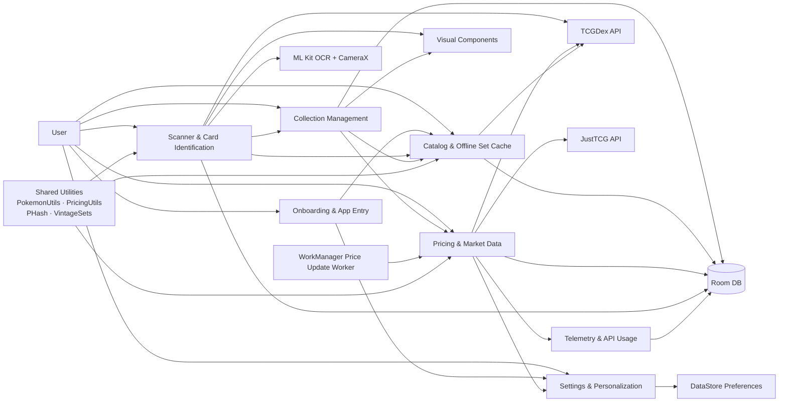

# Vaultio Context Map

## Purpose
This document maps the major bounded contexts, upstream/downstream relationships, and external systems in the `Vaultio` Android application.

The map is based on the current implementation in:
- `app/src/main/java/com/mrhayami/vaultio/MainActivity.kt`
- `app/src/main/java/com/mrhayami/vaultio/VaultioApplication.kt`
- `app/src/main/java/com/mrhayami/vaultio/data/repository/VaultioRepository.kt`
- `app/src/main/java/com/mrhayami/vaultio/data/local/*`
- `app/src/main/java/com/mrhayami/vaultio/data/PHash.kt`
- `app/src/main/java/com/mrhayami/vaultio/data/PokemonUtils.kt`
- `app/src/main/java/com/mrhayami/vaultio/data/PricingUtils.kt`
- `app/src/main/java/com/mrhayami/vaultio/data/VintageSets.kt`
- `app/src/main/java/com/mrhayami/vaultio/ui/collection/*`
- `app/src/main/java/com/mrhayami/vaultio/ui/scanner/*`
- `app/src/main/java/com/mrhayami/vaultio/ui/settings/*`
- `app/src/main/java/com/mrhayami/vaultio/ui/card_detail/*`
- `app/src/main/java/com/mrhayami/vaultio/ui/components/*`
- `app/src/main/java/com/mrhayami/vaultio/ui/navigation/Screen.kt`
- `app/src/main/java/com/mrhayami/vaultio/ui/screens/SetDownloadsScreen.kt`
- `app/src/main/java/com/mrhayami/vaultio/ui/walkthrough/WalkthroughScreen.kt`

> **Last updated:** 2026-04-10 (rev 2)
> Changes in this revision: corrected scanner plan status (ROI crop, 120ms throttle, pHash live in CameraAnalyzer + ScannerViewModel — all done; dual-region OCR still pending); added `ScannerUiState`/`ScannerEvent` MVI detail; expanded Collection Management with full `CollectionUiState`, `ViewMode`, `SortMode`, `SortDirection`, `ListSettings`, `GridSettings`, `PokedexSettings`, `FilterSettings`, `PokedexEntry`; expanded Settings with `ThemeBrand` (11 Pokémon-type themes), `DarkThemeConfig`, `SettingsUiState`, auto-refresh on screen open; noted `PriceMetaEntity` has no DAO yet; Room DB now at version 11.

---

## System Scope
`Vaultio` is a single Android app for managing a Pokémon TCG collection. It supports:
- maintaining a personal card collection
- downloading and caching set/card catalog data for offline use
- scanning cards with OCR-assisted identification
- fetching market pricing from remote services
- storing user preferences, onboarding state, and API credentials
- rendering advanced card visuals (3D tilt, holofoil shader)

Although implemented as one app module, the codebase already contains several distinct business areas that behave like separate bounded contexts.

---

## High-Level Context Map

---

## Bounded Contexts

### 1. Collection Management
**Primary responsibility:** manage the user-owned collection and its organization.

**Core concepts**
- `UserCardEntity`
- `FolderEntity`
- `FolderCardCrossRef`
- `CardWithDetails`
- `CollectionUiState` — full UI state: userCards, filteredUserCards, pokedexEntries, folders, selectedFolderId, searchQuery, isSelectionMode, selectedIds, totalValue, totalCount, totalQuantity, available filter options
- `ViewMode` enum — `LIST`, `GRID`, `POKEDEX`
- `SortMode` enum — `NAME`, `SET`, `VALUE`, `DATE_ADDED`, `RARITY`, `QUANTITY`, `NUMBER`
- `SortDirection` enum — `ASCENDING`, `DESCENDING`
- `ListSettings` — showPrices, isCompact
- `GridSettings` — columns, showBadges
- `PokedexSettings` — showUncollected, useShinySprites
- `FilterSettings` — rarities, categories, types, conditions, finishes (all multi-select)
- `PokedexEntry` — dexNumber, pokemonName, cardCount, totalQuantity, representativeImage, isCollected

**Main implementation points**
- `ui/collection/CollectionViewModel.kt`
- `ui/collection/CollectionScreen.kt`
- `ui/card_detail/CardDetailViewModel.kt`
- `ui/card_detail/CardDetailContract.kt` — formal MVI contract (`CardDetailUiState` / `CardDetailEvent` / `CardDetailEffect`)
- `ui/card_detail/CardDetailScreen.kt`
- `data/local/Entities.kt`
- `data/local/Daos.kt`
- `data/repository/VaultioRepository.kt`

**Capabilities**
- add cards to the collection (from scanner or collection search)
- update quantity / condition / printing / finish
- remove cards; bulk delete and bulk move to folder
- group cards into folders with folder filtering
- full-text search across card name, `pokemonName`, and set name
- multi-select bulk operations (toggle, select-all, clear)
- filter by rarity / category / type / condition / finish
- sort by name, set, value, date added, rarity, quantity, or number (ascending/descending)
- derive total collection value (price × quantity) and summary counts
- derive Pokédex-style view from dex IDs and extracted Pokémon names
- search TCGDex remotely for adding new cards

**Depends on**
- **Catalog & Offline Set Cache** for canonical card and set identities
- **Pricing & Market Data** for computed collection value (allPrices + allVintagePrices flows)
- **Settings & Personalization** for view/sort/list/grid/pokédex preferences and `preferSetLogo`
- **Visual Components** for card rendering (3D tilt, holofoil shader)
- **PokemonUtils** for Pokédex name extraction in the Pokédex view computation

**Relationship style**
- downstream of `Catalog & Offline Set Cache`
- downstream of `Pricing & Market Data`

---

### 2. Catalog & Offline Set Cache
**Primary responsibility:** maintain the local reference catalog of sets and cards.

**Core concepts**
- `SetEntity`
- `CardEntity` (now includes `dexIds`, `pokemonName`, `tcgPlayerId`, `pHash` fields)
- downloaded vs non-downloaded sets
- local searchable card catalog
- dex ID enrichment and fallback resolution
- perceptual hash storage for scanner disambiguation

**Main implementation points**
- `ui/screens/SetDownloadsScreen.kt`
- `VaultioRepository.refreshSets()`
- `VaultioRepository.downloadSet()`
- `VaultioRepository.deleteDownloadedSet()`
- `VaultioRepository.searchLocalCards()`
- `VaultioRepository.searchLocalCardsWithTotal()`
- `data/PokemonUtils.kt` ← _new: static Pokédex map + name extraction used during set download_
- `data/PHash.kt` ← _new: dHash perceptual hashing for card images_
- `data/VintageSets.kt` ← _new: vintage set configuration registry (base1–neo4)_

**Capabilities**
- pull set metadata from TCGDex
- download full set details into Room
- preserve download flags across refreshes
- keep local set/card data usable for offline matching
- enrich cards with dex IDs and TCGPlayer IDs at download time
- extract and store `pokemonName` at download time via `PokemonUtils`
- compute and store `pHash` for each card image (in-progress, per `plan-cardScanningOptimization`)

**External dependency**
- **TCGDex API** is the authoritative upstream catalog provider

**Relationship style**
- customer/supplier with `TCGDex API`
- upstream to `Collection Management`
- upstream to `Scanner & Card Identification`
- upstream to parts of `Pricing & Market Data`

---

### 3. Scanner & Card Identification
**Primary responsibility:** identify cards from camera input using OCR and local/remote lookup.

**Core concepts**
- OCR frame analysis (ML Kit Text Recognition v2)
- name region extraction (top ~15% of card)
- collector number extraction (bottom-right ~20% of card)
- per-region image preprocessing (adaptive threshold, upscale, sharpen)
- multi-frame consensus (5-frame, 3-of-5)
- collector-number correction engine (±1 digit, approximate total matching)
- hybrid scoring ranker (name similarity + number match + pHash distance)
- candidate ranking and auto-selection
- perceptual hash disambiguation via `PHash.kt`

**Main implementation points**
- `ui/scanner/CameraAnalyzer.kt`
- `ui/scanner/ScannerViewModel.kt`
- `ui/scanner/ScannerScreen.kt`
- `ui/components/MetadataModal.kt` ← _new: presented when scanner confirms a card, before saving_
- `data/PHash.kt` ← _new: used for candidate disambiguation_
- `data/PokemonUtils.kt` ← _new: used for name normalization and dex ID fallback_

**Capabilities**
- capture live camera frames via CameraX
- crop to card ROI before OCR (reduces noise and compute)
- run dual-region OCR: name zone and number zone independently
- extract top-of-card name and bottom collector number
- apply aggressive per-zone preprocessing for number legibility
- scope character-substitution normalization to numeric tokens only
- attempt fuzzy set-total correction when exact query returns no results
- stabilize noisy OCR with a short history buffer
- prefer local offline matches before remote search
- compute pHash from live frame crop and compare against stored card hashes
- rank candidates with composite score when multiple remain
- present `MetadataModal` overlay for quantity/condition/printing/finish entry
- save matched cards into the collection

**Depends on**
- **Catalog & Offline Set Cache** for fast local resolution and pHash lookup
- **Collection Management** to persist identified cards as owned cards
- **TCGDex API** for remote fallback search
- **ML Kit OCR + CameraX** as platform/external capabilities

**Relationship style**
- downstream of `Catalog & Offline Set Cache`
- feeds `Collection Management`
- conformist/customer to `TCGDex API` response model

> **In-progress plans:**
> - `plan-cardScanningOptimization.prompt.md` — dual-region OCR, preprocessing, pHash disambiguation
> - `plan-manaBoxStyleScannerPipeline.prompt.md` — ManaBox-style region-targeted pipeline with hybrid scorer

---

### 4. Pricing & Market Data
**Primary responsibility:** resolve current market prices and quota/telemetry around pricing calls.

**Core concepts**
- `PriceEntity`
- `VintagePriceEntity`
- `PriceMetaEntity` ← _new: tracks last-fetch time and last error per (cardId, finish, condition)_
- `ApiUsageEntity`
- `TelemetryLogEntity`
- modern vs vintage pricing strategy
- TCGDex primary pricing
- JustTCG fallback and vintage specialization
- `VintageSets` registry for vintage set routing

**Main implementation points**
- `VaultioRepository.updateCardPrice()`
- `VaultioRepository.updateVintageCardPrice()`
- `VaultioRepository.updateCardPriceFromJustTCG()`
- `VaultioRepository.updatePricesBatch()`
- `data/workers/PriceUpdateWorker.kt`
- `data/PricingUtils.kt` ← _new: standardized finish/printing/condition constants + TCGDex/JustTCG mapping helpers_
- `data/VintageSets.kt` ← _new: vintage set ID registry and JustTCG routing_

**Capabilities**
- fetch standard prices from TCGDex
- fall back to JustTCG when needed
- use JustTCG as primary source for vintage set logic
- route vintage sets to the correct JustTCG set ID (including shadowless variants) via `VintageSets`
- normalize finish/printing/condition strings across sources via `PricingUtils`
- map TCGDex and JustTCG price responses to `PriceEntity` / `VintagePriceEntity`
- track per-record fetch metadata in `PriceMetaEntity`
- store per-day API usage and plan limits
- log endpoint/status/latency telemetry
- run background refreshes through WorkManager

**Depends on**
- **Catalog & Offline Set Cache** for card identity and metadata
- **Settings & Personalization** for JustTCG API key
- **TCGDex API** and **JustTCG API** for external price data

**Relationship style**
- downstream of `Catalog & Offline Set Cache`
- downstream of `Settings & Personalization`
- customer/supplier with `TCGDex API`
- customer/supplier with `JustTCG API`
- upstream to `Collection Management` for valuation

---

### 5. Settings & Personalization
**Primary responsibility:** store user preferences, feature toggles, credentials, and app-entry state.

**Core concepts**
- theme brand / dark mode
- animation flags (energy animations, finish animations)
- set-logo preference
- view/sort/layout settings
- JustTCG API key
- walkthrough completion state

**Main implementation points**
- `data/UserPreferencesRepository.kt`
- `ui/settings/SettingsViewModel.kt`
- `ui/settings/SettingsScreen.kt`
- startup logic in `MainActivity.kt`

**Capabilities**
- persist preferences in DataStore
- control app theming and layout defaults
- store and expose JustTCG API key
- decide whether walkthrough shows on startup
- refresh and expose JustTCG usage/quota state in settings
- expose animation feature flags consumed by `CardDetailUiState` and visual components

**Depends on**
- `DataStore Preferences`
- `Pricing & Market Data` for quota refresh/display

**Relationship style**
- upstream to `Pricing & Market Data` because API key enables JustTCG access
- upstream to UI-facing contexts because it drives behavior and presentation

---

### 6. Onboarding & App Entry
**Primary responsibility:** guide first-run setup and route the user into the app.

**Core concepts**
- walkthrough pages
- first-run gating
- navigation start destination
- recommended setup guidance

**Main implementation points**
- `ui/walkthrough/WalkthroughScreen.kt`
- `ui/navigation/Screen.kt` ← _new: sealed class defining all navigation routes_
- `MainActivity.kt`

**Capabilities**
- decide first screen based on `shouldShowWalkthrough`
- instruct the user to:
  - add a JustTCG API key
  - download sets for better scanning
  - understand feature tradeoffs

**Depends on**
- **Settings & Personalization** for walkthrough completion state
- indirectly influences **Catalog & Offline Set Cache** and **Pricing & Market Data** through user setup behavior

**Relationship style**
- downstream of `Settings & Personalization`
- advisory upstream influence on `Catalog & Offline Set Cache` and `Pricing & Market Data`

---

### 7. Visual Components (new context)
**Primary responsibility:** provide reusable, presentation-only Compose components for card rendering and data-entry overlays.

**Core concepts**
- 3D gyroscope-driven card tilt
- touch gesture pan/zoom
- holofoil shader (spectral gradient, specular flare, galaxy grain)
- finish-specific overlay selection (normal, holofoil, reverse, textured, gold)
- card metadata entry modal (quantity, condition, printing, finish, folder assignment)

**Main implementation points**
- `ui/components/ThreeDCard.kt` — `ThreeDCardContainer` composable; uses device rotation-vector sensor for gyro tilt + `pointerInput` for touch gestures
- `ui/components/VisualEffects.kt` — `Modifier.holoEffect(...)` and finish-specific `Modifier` extensions; pure Compose `drawWithContent` shaders
- `ui/components/MetadataModal.kt` — `MetadataModal` composable; presented by scanner before saving a confirmed card; driven by `PricingUtils` constants

**Capabilities**
- render a card image with real-time 3D perspective rotation
- apply per-finish animated holofoil overlays
- present an add-to-collection form (quantity/condition/printing/finish/folder chips)
- expose a reusable `DropdownSelector` for picker fields
- remain stateless with respect to business logic (pure presentation)

**Depends on**
- `PricingUtils` for finish/printing/condition constants (display only)
- `FolderEntity` list provided by the caller for folder chip rendering
- No direct Room or API dependency

**Relationship style**
- consumed by `Collection Management` (card detail) and `Scanner & Card Identification` (metadata modal)
- pure downstream presentation layer; no upstream influence on any business context

---

## Shared Kernel
These concepts are effectively shared across multiple contexts and should be treated carefully because changes ripple broadly:

### Shared domain identities
- `SetEntity`
- `CardEntity` (now with `dexIds`, `pokemonName`, `tcgPlayerId`, `pHash`)
- `UserCardEntity`
- card ID / set ID / local collector number
- dex ID / Pokémon name normalization

### Shared utility layer (new)
| Utility | Package | Used by |
|---|---|---|
| `PokemonUtils` | `data/` | Catalog (download enrichment), Scanner (name normalization + dex fallback) |
| `PricingUtils` | `data/` | Pricing (source mapping), Visual Components (constants), Scanner (MetadataModal) |
| `PHash` | `data/` | Catalog (hash storage at download), Scanner (frame disambiguation) |
| `VintageSets` | `data/` | Pricing (vintage routing to JustTCG set IDs) |

### Shared application service seam
- `VaultioRepository`

This repository currently acts as a broad integration layer across catalog, collection, pricing, and settings concerns. It is the main shared service boundary in the current architecture.

### Shared persistence model
- Room database in `data/local/VaultioDatabase.kt`
- cross-context tables: `sets`, `cards`, `user_cards`, `folders`, `prices`, `vintage_prices`, `price_meta` _(new)_, `api_usage`, `telemetry_log`

---

## External Systems and Platform Services

### External domain providers
1. **TCGDex API**
   - upstream source for set metadata
   - upstream source for card details and search
   - primary price source for many modern cards

2. **JustTCG API**
   - fallback or specialized pricing source
   - authoritative source for vintage pricing behavior in this app
   - source of rate-limit and plan metadata

### Device/platform capabilities
3. **ML Kit OCR (Text Recognition v2)**
   - recognizes text from camera frames
   - core dependency of the scanner context
   - currently run in two passes per frame (name region + number region, per plan)

4. **CameraX**
   - provides frame analysis stream for scanning

5. **Device Rotation Vector Sensor**
   - used by `ThreeDCard.kt` to drive real-time card tilt based on physical device orientation

### Persistence/infrastructure
6. **Room**
   - shared persistence mechanism for all business contexts except preferences
   - tables: `sets`, `cards`, `user_cards`, `folders`, `prices`, `vintage_prices`, `price_meta`, `api_usage`, `telemetry_log`

7. **DataStore Preferences**
   - persistence for settings, onboarding state, and credentials

8. **WorkManager**
   - background scheduling for collection-wide price refresh

---

## Relationship Summary

| Upstream | Downstream | Relationship | Notes |
|---|---|---|---|
| `TCGDex API` | `Catalog & Offline Set Cache` | Customer/Supplier | TCGDex defines remote set/card schema consumed locally |
| `Catalog & Offline Set Cache` | `Scanner & Card Identification` | Upstream/Downstream | Scanner prefers local card lookup for speed and offline use |
| `Catalog & Offline Set Cache` | `Collection Management` | Upstream/Downstream | Collection relies on canonical set/card metadata |
| `Collection Management` | `Pricing & Market Data` | Downstream dependency | Price refreshes are triggered by owned cards |
| `Pricing & Market Data` | `Collection Management` | Upstream information provider | Collection value depends on pricing results |
| `Settings & Personalization` | `Pricing & Market Data` | Upstream/Downstream | JustTCG API key and user settings gate pricing behavior |
| `Scanner & Card Identification` | `Collection Management` | Partnership-like flow | Scanner creates owned cards in the collection via MetadataModal |
| `JustTCG API` | `Pricing & Market Data` | Customer/Supplier | Used for fallback pricing, vintage pricing, and quota sync |
| `Settings & Personalization` | `Onboarding & App Entry` | Upstream/Downstream | Walkthrough state controls app start flow |
| `Onboarding & App Entry` | `Catalog & Offline Set Cache` | Advisory influence | Walkthrough nudges users to download sets |
| `Shared Utilities` | `Catalog & Offline Set Cache` | Shared Kernel | PokemonUtils, PHash used at download/enrichment time |
| `Shared Utilities` | `Scanner & Card Identification` | Shared Kernel | PHash for disambiguation; PokemonUtils for name normalization |
| `Shared Utilities` | `Pricing & Market Data` | Shared Kernel | PricingUtils for source mapping; VintageSets for routing |
| `Visual Components` | `Collection Management` | Pure downstream | ThreeDCard + VisualEffects rendered in CardDetail |
| `Visual Components` | `Scanner & Card Identification` | Pure downstream | MetadataModal presented after card identification |

---

## Current Architectural Observations

### 1. The app is modular by behavior, not by module boundaries
All bounded contexts live inside one Gradle app module, but they are conceptually distinct.

### 2. `VaultioRepository` is a central integration hub
It currently contains logic for:
- catalog synchronization
- card enrichment (including dex ID and pHash population)
- collection persistence
- pricing orchestration
- quota sync
- telemetry logging

That makes it convenient, but also means the repository is carrying multiple context responsibilities.

### 3. Catalog is the most central upstream business context
`Scanner`, `Collection`, and `Pricing` all rely on the same local card/set identity model. The `CardEntity` now carries richer metadata (`dexIds`, `pokemonName`, `tcgPlayerId`, `pHash`) computed at download time.

### 4. Pricing is a separate subdomain with its own rules
Vintage handling, API quota awareness, telemetry, multi-source resolution, and the `VintageSets` routing registry indicate that pricing is more than a simple helper service.

### 5. Settings is operationally important, not just cosmetic
The stored JustTCG API key and walkthrough state materially change business behavior. Animation flags in settings directly drive `CardDetailUiState.showEnergyAnimations` and `showFinishAnimations`.

### 6. A shared utility layer has emerged
`PokemonUtils`, `PricingUtils`, `PHash`, and `VintageSets` are stateless objects in `data/` that are consumed by multiple bounded contexts. They are now the **Shared Kernel** for domain vocabulary (finish names, condition strings, dex numbers, vintage set IDs, image hashing).

### 7. Visual Components are a clear presentation-only sublayer
The `ui/components/` package is pure Compose UI with no Room or API dependencies. It consumes `PricingUtils` constants only for labels. This is a clean boundary.

### 8. Two screen layers exist (active vs. scaffold placeholders)
The `ui/screens/CollectionScreen.kt` and `ui/screens/SettingsScreen.kt` are scaffold stubs ("Coming Soon"). The real implementations live in `ui/collection/` and `ui/settings/`. These stubs are likely legacy artifacts from an earlier architecture exploration.

### 9. Scanner pipeline is actively evolving
Three plan files document an in-progress upgrade from a single-pass OCR approach to a dual-region, region-targeted pipeline with hybrid scoring. Key structural changes already in code:
- `PHash.kt` is implemented
- `CardEntity.pHash` column exists
- `PokemonUtils` handles generic possessive prefixes and full Gen 1–9 dex map
- `CardDao.getCardsByPokemonName()` exact-match query exists

---

## In-Progress Plans

| Plan file | Area | Status |
|---|---|---|
| `plan-dexIdFallbackResolution.prompt.md` | Catalog + Scanner | Mostly implemented: PokemonUtils full dex map, generic possessives, `getCardsByPokemonName` DAO |
| `plan-cardScanningOptimization.prompt.md` | Scanner | Partially implemented: PHash.kt exists, `CardEntity.pHash` exists; ROI cropping & preprocessing pipeline pending |
| `plan-manaBoxStyleScannerPipeline.prompt.md` | Scanner | Planned: dual-region OCR, correction engine, hybrid scorer |

---

## Suggested Bounded Context Names for Future Refactoring
If the app is later split into feature packages/modules, these names would fit the current code well:
- `catalog`
- `collection`
- `scanner`
- `pricing`
- `settings`
- `onboarding`
- `shared-kernel` or `core-model` (PokemonUtils, PricingUtils, PHash, VintageSets)
- `ui-components` (ThreeDCard, VisualEffects, MetadataModal)

---

## Concise Map in Plain English
- **Catalog** owns the canonical local set/card reference data, enriched with dex IDs, Pokémon names, TCGPlayer IDs, and perceptual hashes at download time.
- **Scanner** identifies a card using dual-region OCR + pHash disambiguation, presents the MetadataModal for user input, then hands the result to collection management.
- **Collection** owns the user's actual inventory and organization, rendering cards with 3D and holofoil effects from Visual Components.
- **Pricing** enriches collected cards with market value using TCGDex and JustTCG, with `VintageSets` routing and `PricingUtils` normalization across both sources.
- **Settings** controls preferences, credentials, animation flags, and startup behavior.
- **Onboarding** helps the user configure settings and improve future scanner/catalog behavior.
- **Visual Components** provides stateless 3D/holofoil/metadata-entry UI consumed by Collection and Scanner.
- **Shared Utilities** (`PokemonUtils`, `PricingUtils`, `PHash`, `VintageSets`) form the shared kernel of domain vocabulary used across contexts.

---

## Source-of-Truth Notes
This context map reflects the current implementation, not an idealized target architecture. In the present codebase:
- the boundaries are conceptual rather than enforced by module isolation
- `VaultioRepository` crosses multiple contexts
- Room acts as a shared persistence boundary rather than separate per-context stores
- `ui/screens/CollectionScreen.kt` and `ui/screens/SettingsScreen.kt` are scaffold stubs; the production implementations are in `ui/collection/` and `ui/settings/`

That said, the domain seams are already visible enough to use this map for planning, documentation, or future modularization.
